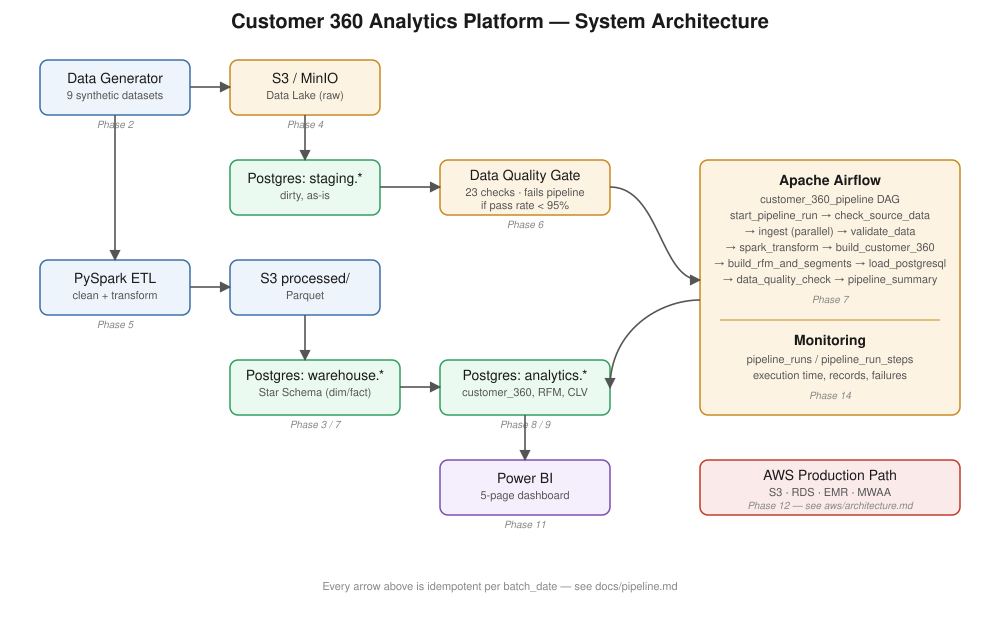
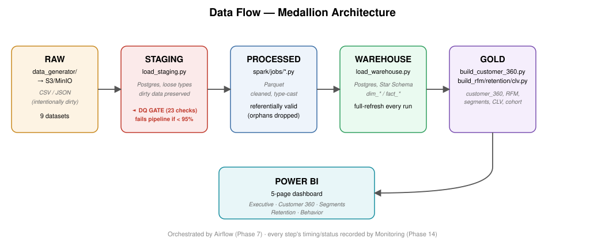
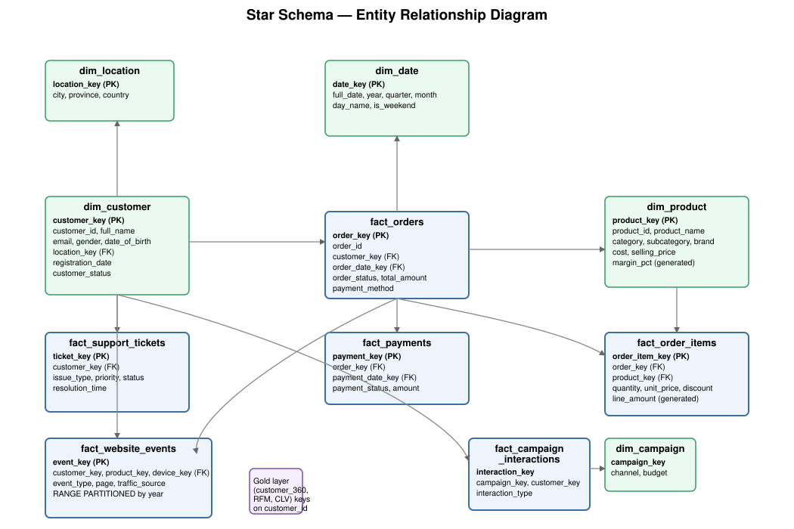

# Customer 360 Analytics Platform

> **Status:** ✅ Phase 16 of 16 — Complete. All phases finished. See [Progress](#progress) below.

An end-to-end data platform that unifies customer data from orders, payments,
website behavior, support tickets, and marketing campaigns into a single
**Customer 360°** view — powering RFM segmentation, Customer Lifetime Value,
retention/churn analysis, and a Power BI business intelligence layer.

## 1. Project Overview
*(To be expanded in Phase 15 — Documentation)*

This project simulates a realistic e-commerce data environment and builds a
production-style analytics pipeline on top of it:

```
Raw Sources → S3 Data Lake → Airflow → PySpark ETL → Data Quality →
Analytics Warehouse (PostgreSQL / RDS) → SQL Analytics → Power BI
```

## 2. Business Problem
A retail business has customer data scattered across separate systems
(orders, web analytics, support, marketing) and cannot answer basic
questions like "who are our most valuable customers?" or "who is about to
churn?" This platform consolidates that data into a single customer view
and a set of standard analytics products (RFM, CLV, retention, segments).

## 3. Objectives
- Build a reproducible, idempotent ETL/ELT pipeline (Airflow + PySpark)
- Model a Star Schema analytics warehouse in PostgreSQL
- Compute Customer 360, RFM, CLV, retention/churn metrics from real
  (synthetic) transaction data
- Enforce data quality gates (>= 95% pass rate) before promoting data
- Deliver a 5-page Power BI dashboard for business stakeholders
- Design (and document) a path to AWS (S3 + RDS + IAM + CloudWatch)

## 4. Architecture
See [`docs/architecture.md`](docs/architecture.md) for the full system
diagram and design principles, and [`aws/architecture.md`](aws/architecture.md)
for the production AWS version of the same architecture.





## 5. Technology Stack
| Layer            | Technology                                   |
|------------------|-----------------------------------------------|
| Language          | Python 3.12                                   |
| Big Data          | Apache Spark (PySpark) 3.5                    |
| Orchestration     | Apache Airflow 2.9                            |
| Database          | PostgreSQL 16                                 |
| Cloud (designed)  | AWS S3, RDS PostgreSQL, IAM, CloudWatch       |
| BI                | Microsoft Power BI                            |
| Containerization  | Docker, Docker Compose                        |
| Data Quality      | Custom SQL-based check engine (`data_quality/`)|

## 6. Data Sources
`customers`, `orders`, `order_items`, `products`, `payments`,
`website_events`, `customer_support`, `marketing_campaigns`,
`campaign_interactions` — all synthetic, generated locally
(see `data_generator/`, added in Phase 2).

## 6b. Data Generation

All 9 datasets are produced by `data_generator/`, a fully vectorized
(NumPy/pandas, no per-row Python loops) generator so it stays fast even
at the "large" scale target.

**Scale presets** (`data_generator/config.py`):

| Preset  | customers | orders     | order_items (~) | website_events | Measured time |
|---------|-----------|------------|------------------|-----------------|---------------|
| `test`  | 500       | 1,500      | ~3,500           | ~5,800          | < 1 sec       |
| `dev`   | 100,000   | 500,000    | ~1,150,000       | ~2,300,000      | ~39 sec       |
| `large` | 1,000,000 | 10,000,000 | ~23,000,000      | ~50,000,000     | (run on your own machine — GB-scale output) |

Run it:
```bash
docker compose exec etl python -m data_generator.generate_all --scale test --out-dir /opt/data
docker compose exec etl python -m data_generator.generate_all --scale dev --dirty-rate 0.02 --out-dir /opt/data
```

Output lands in `data/raw/<dataset>/batch_date=<YYYY-MM-DD>/`, mirroring
the S3 raw-layer layout — regenerating the same `--batch-date` overwrites
only that partition (idempotent, per Section 8).

**Realism built in:**
- Customer order activity follows a Pareto (power-law) distribution — a
  minority of customers place most orders, which is what makes RFM/CLV
  segmentation meaningful later instead of every customer looking identical.
- `order.total_amount` is derived from (and reconciles with) the sum of
  its generated `order_items`.
- `payment_status` is correlated with the parent order's `order_status`.
- Website events are generated per *session* (shared device/traffic
  source, monotonically increasing timestamps) rather than as
  independent random rows.
- Support ticket volume is skewed higher for `churned` customers.

**Intentional data-quality issues** (`--dirty-rate`, default 2%) are
injected on purpose — nulls, invalid emails, negative amounts, orphan
foreign keys, duplicate rows — so the Phase 6 Data Quality framework has
real problems to catch instead of a suspiciously perfect dataset.

Small, human-readable samples of every dataset are committed at
`data/sample/*_sample.csv` (20 rows each) for quick inspection without
running the generator. Full generated output stays git-ignored.

Tests: `pytest tests/test_data_generator.py -v` (21 tests — row counts,
referential integrity, total-amount reconciliation, date ordering,
dirty-rate injection, and seed reproducibility).

## 6c. Database (PostgreSQL Analytics Warehouse)

Four schemas, each with a distinct role:

| Schema      | Purpose                                                                 |
|-------------|--------------------------------------------------------------------------|
| `staging`   | Raw-shaped landing tables (one per source dataset), reloaded every run — loosely typed, no constraints, so dirty data lands intact for Phase 6 Data Quality to measure. |
| `warehouse` | **Star Schema**: 6 dimensions (`dim_customer`, `dim_product`, `dim_date`, `dim_campaign`, `dim_device`, `dim_location`) + 6 facts (`fact_orders`, `fact_order_items`, `fact_payments`, `fact_website_events`, `fact_support_tickets`, `fact_campaign_interactions`). Only quality-checked data lands here — real FK constraints enforced. |
| `analytics` | Gold layer: `customer_360`, `customer_rfm`, `customer_segments`, `customer_monthly_metrics`, `customer_cohort`, `data_quality_results`. |
| *(deploy)*  | Applied in one command via `python -m sql.ddl_deploy` (thin `psql -f` wrapper, runs all DDL in dependency order). |

**Notable design decisions:**
- `fact_website_events` — the largest table by design (2M+ rows at
  `dev` scale, 50M+ at `large`) — uses native PostgreSQL **RANGE
  partitioning by year** on `event_timestamp`, so time-filtered
  queries only scan the relevant partition instead of the whole table.
- Generated (computed) columns: `dim_product.margin_pct`,
  `fact_order_items.line_amount`, `data_quality_results.pass_rate` —
  always consistent, can't drift from their source columns.
- `dim_customer` is Type-1 (overwrite) for this project's scope, with
  `_loaded_at`/`_updated_at` columns already in place so it could be
  upgraded to Type-2 (row versioning) later without a schema rewrite.
- Full-refresh model: `warehouse`/`analytics` tables are rebuilt by
  the Spark jobs each run rather than incrementally upserted — the
  right trade-off at this data volume, simpler to reason about and
  test than incremental merge logic.

Run it:
```bash
docker compose exec etl python -m sql.ddl_deploy
docker compose exec etl pytest tests/test_database_schema.py -v
```

## 6d. Data Lake (S3 / MinIO)

`data_lake/` is a thin boto3 wrapper (`s3_client.py`, `lake_paths.py`,
`sync_to_lake.py`) that uploads local `data/raw/` partitions into an
S3-shaped bucket, following the layout in [`aws/s3.md`](aws/s3.md):

```
s3://customer-360-data/raw/<dataset>/batch_date=YYYY-MM-DD/<dataset>.<csv|json>
```

**Runs against MinIO locally, unchanged against real AWS S3 later** —
the only difference is one environment variable (`AWS_S3_ENDPOINT_URL`),
set to `http://minio:9000` in `docker-compose.yml` for local dev and
simply absent when deployed to AWS. No code branches on "am I local or
in AWS" anywhere in `data_lake/`.

```bash
docker compose up -d minio
docker compose exec etl python -m data_generator.generate_all --scale test --out-dir /opt/data
docker compose exec etl python -m data_lake.sync_to_lake --batch-date $(date +%F) --base-dir /opt/data
```

MinIO's web console is at http://localhost:9001 (login with
`MINIO_ROOT_USER` / `MINIO_ROOT_PASSWORD` from `.env`) for browsing
uploaded objects visually.

Tests (`tests/test_data_lake.py`, 7 tests) use `moto` to mock AWS S3 —
they verify bucket creation, correct key structure, idempotent
re-sync, and graceful handling of partially-generated batches,
without needing a running MinIO container or real AWS credentials.

## 6e. Spark ETL

`spark/` cleans every raw dataset and writes it to the processed
(Parquet) layer, with a shared toolkit (`spark/utils/`) so each job is
a short, readable sequence of named steps rather than copy-pasted
regex/join logic:

| Module | Purpose |
|--------|---------|
| `spark_session.py` | Builds a tuned `SparkSession` (AQE on, broadcast threshold raised to 64MB, snappy Parquet, MinIO/S3 wiring shared with `data_lake/`). |
| `schemas.py` | Explicit `StructType` per raw dataset — avoids `inferSchema`'s double-read cost and silent type-widening. |
| `cleaning.py` | Reusable primitives: `drop_null_key`, `deduplicate`, `flag_invalid_email`, `clip_negative_amount`, `filter_valid_date_range`, `validate_allowed_values`, `anti_join_orphans` (with an explicit broadcast/no-broadcast choice per call site). |

**Jobs** (`spark/jobs/`, run individually or all via `run_all.py`):
`clean_customers`, `clean_products`, `clean_orders` (+ `order_items`,
FK-validated against cleaned customers/products), `clean_payments`,
`clean_customer_support`, `clean_marketing` (campaigns + interactions),
`transform_events` (also derives `session_summary` and
`daily_top_products` using window functions — `PARTITION BY
session_id` for session aggregates, `RANK() OVER (PARTITION BY
event_date ORDER BY view_count DESC)` for top-N-per-day).

```bash
docker compose exec etl python -m spark.jobs.run_all --batch-date 2026-09-06 --base-dir /opt/data
```

**Performance techniques applied (Section 9 requirement) and why:**
- **Explicit schemas** instead of `inferSchema` — one read instead of two, no silent type-widening.
- **`.cache()`** on DataFrames read/counted multiple times (every job logs before/after row counts at each cleaning step) — without it, Spark would re-read and re-parse the source file for every `.count()`.
- **Broadcast joins** for referential-integrity checks against small dimensions (`products`, `marketing_campaigns` — thousands of rows even at `large` scale) — ships the whole dimension to every executor, avoiding a shuffle of the much bigger fact table.
- **Explicitly *not* broadcasting** the `customers` dimension (up to ~1M rows at `large` scale) — broadcasting something that big would cost more in serialization/network than a normal sort-merge join. Knowing when *not* to broadcast is as much the skill as knowing when to.
- **`coalesce(N)`** before every Parquet write — Spark's default is one output file per task; at this project's row counts that's needlessly many small files, which hurts every downstream reader (more S3 LIST/GET calls, more planning overhead).
- **Predicate pushdown** — a natural consequence of writing Parquet with real column statistics; downstream SQL/Spark readers filtering on any column benefit automatically.

**Real bugs found and fixed while building this phase (not guessed —
caught by actually running the jobs against real data):**
1. `date_of_birth` was nulled out almost entirely because it shared a
   validity window meant for transactional dates — fixed by giving
   each date column its own plausible range.
2. **A Phase 2 bug**: `pandas.to_json()` serializes datetimes as epoch
   *milliseconds* by default, but Spark's `TimestampType` JSON parser
   reads a bare number as epoch *seconds* — a 1000x mismatch that
   turned 2026 into the year 58642. Fixed at the source
   (`data_generator/utils.py`) with `date_format="iso"`, and the raw
   `website_events.json` now carries human-readable ISO8601 timestamps.
3. `data_generator`'s `inject_duplicates()` helper existed but was
   never actually called anywhere — Phase 6's uniqueness checks would
   have had nothing real to catch. Now wired into `customers.py` and
   `orders.py`.

Tests: `pytest tests/test_spark_etl.py -v` (12 tests, real local
Spark sessions — cleaning primitives, broadcast vs non-broadcast
anti-joins, and window-function correctness including `RANK()` tie
semantics, not mocks).

## 6f. Data Quality

`data_quality/` loads raw (dirty) data into Postgres `staging.*`
tables, runs 23 SQL-based checks against it covering all six
dimensions from Section 10, persists every result to
`analytics.data_quality_results`, writes a JSON report, and **fails
the pipeline** (non-zero exit code) if any critical check falls below
the pass-rate threshold — this is what Airflow's `data_quality_check`
task (Phase 7) will call.

| Module | Purpose |
|--------|---------|
| `load_staging.py` | Loads `data/raw/*` into `staging.stg_*` via `COPY` (fast bulk load), preserving nulls/duplicates/orphans/negative amounts exactly as generated — staging exists specifically so DQ checks have real dirty data to measure. |
| `checks.py` | The check registry (23 `DQCheck` definitions) + runner. Each check is one SQL statement returning `(total, failed)`; `pass_rate` is derived, never hand-entered. |
| `run_checks.py` | CLI: prints a summary table, exits `0` on overall PASS / `1` on FAIL. |

**Dimensions covered, with real check counts:**

| Dimension | Checks | Example |
|-----------|--------|---------|
| Completeness | 5 | `customers.customer_id IS NOT NULL` |
| Uniqueness | 3 | `orders.order_id` has no duplicate rows |
| Validity | 6 | email regex, allowed status values, amounts ≥ 0 |
| Accuracy | 2 | `products.cost <= selling_price`; `orders.total_amount` reconciles with `SUM(order_items)` |
| Referential integrity | 6 | `order_items.product_id` exists in `products`, etc. |
| Consistency | 1 | `payments.amount` agrees with its order's `total_amount` |

Two checks (the order-total reconciliation and the payment-consistency
check) are marked **non-critical** — a few penny-level rounding
mismatches get reported but don't halt the pipeline the way a broken
foreign key does; this distinction is deliberate, not every failed
check should carry equal weight.

```bash
docker compose exec etl python -m data_quality.load_staging --batch-date 2026-09-06 --base-dir /opt/data
docker compose exec etl python -m data_quality.run_checks --batch-date 2026-09-06
# exit code 0 = PASS, 1 = FAIL (below DQ_MIN_PASS_RATE, default 95%)
```

**Real bugs found and fixed while building this phase:**
1. psycopg2 interprets a bare `%` in SQL as a parameter placeholder —
   the email-format regex (`[A-Za-z0-9._%+-]`) needed escaping to
   `%%`, caught immediately by `TypeError: dict is not a sequence`
   on the very first real run.
2. The actual `analytics.data_quality_results` table (built in Phase
   3) has `pass_rate` as a **generated column** and an auto-increment
   integer `check_id` — my first draft assumed a hand-computed
   `pass_rate` and a text business key. Checking the real DDL instead
   of the plan caught this before it ever reached a test.
3. When a custom `--min-pass-rate` was passed, the per-check PASS/FAIL
   labels still silently used the hard-coded 95% environment default
   for display while the overall gate correctly used the override —
   found by deliberately forcing a 99.9% threshold and noticing the
   summary table still said "PASS" next to rows that should fail.

Tests: `pytest tests/test_data_quality.py -v` (14 tests against the
real local Postgres instance) — exact failed-row counts on known-bad
data, the pipeline-failing gate actually failing/passing correctly,
non-critical failures not blocking the gate, and idempotent re-runs.

## 6g. Airflow

`airflow/dags/customer_360_pipeline.py` orchestrates every phase built
so far into one DAG, matching the 13-task list in Section 8 exactly:

```
check_source_data
  -> ingest_raw_to_lake (TaskGroup: 9 parallel tasks, one per raw dataset)
  -> validate_data          (load_staging + Phase 6 DQ gate — fails the run on bad data)
  -> spark_transform        (Phase 5: all Spark cleaning/transform jobs)
  -> build_customer_360     (Phase 8 placeholder — see below)
  -> build_rfm_and_segments (Phase 9 placeholder — see below)
  -> load_postgresql        (spark/jobs/load_warehouse.py — full-refresh into the Star Schema)
  -> data_quality_check     (post-load smoke test on warehouse.*, distinct from validate_data)
  -> pipeline_summary       (logs a run summary; trigger_rule=all_done so it runs even on failure)
```

**Two tasks are placeholders on purpose.** This project's own phase
order (Section 27) puts Airflow (Phase 7) *before* Customer 360 (Phase
8) and RFM/CLV (Phase 9) — so `build_customer_360` and
`build_rfm_and_segments` currently log a clear "Phase 8/9 placeholder"
warning and no-op. The task shape (name, position, retries, timeout)
is final today; only the callable body changes once those phases land,
so no DAG rewrite is needed later.

**Idempotency:** every task keys off `{{ ds }}` as `batch_date`, and
every script it calls (data_generator, sync_to_lake, load_staging,
Spark jobs, load_warehouse) was already built in earlier phases to
overwrite-by-partition or full-refresh rather than append — re-running
any task, or the whole DAG, for the same date does not duplicate data.

**A real architecture gap found and fixed while building this phase:**
the DAG's task callables directly `import` this project's own packages
(`data_lake`, `spark.jobs`, `data_quality`) rather than shelling out —
which meant the original docker-compose setup (vanilla `apache/airflow`
image, only `./airflow/dags` mounted) would have failed immediately in
Docker despite working in this sandbox, where PySpark/boto3/psycopg2
happened to already be installed system-wide for earlier phases' tests.
Fixed with `Dockerfile.airflow` — extends the official image with a
JRE (PySpark needs a real JVM) and this project's `requirements.txt`,
installed against Airflow's own published constraints file (the
officially documented way to add packages to the Airflow image) — plus
mounting `data_generator/`, `data_lake/`, `spark/`, `data_quality/`,
and `sql/` into the container alongside `dags/`, with `PYTHONPATH=/opt/airflow`
so they resolve as top-level packages.

```bash
docker compose up -d --build airflow-webserver airflow-scheduler
# UI at http://localhost:8080 (login: AIRFLOW_ADMIN_USER / _PASSWORD from .env)
# Trigger customer_360_pipeline manually, or let @daily scheduling run it.
```

**Tested for real, not just written:** Apache Airflow 2.9.1 was
installed in this environment and every one of the 13 tasks was run
through `airflow tasks test` against the real local Postgres and real
generated data — including deliberately forcing the DQ gate to fail
(`DQ_MIN_PASS_RATE=0.999`) and confirming `validate_data` actually
raises, fails, and is marked `UP_FOR_RETRY` by Airflow's own retry
policy, not just logging a warning and continuing.

Tests: `pytest tests/test_airflow_dag.py -v` (12 tests — DAG parses
with no import errors, correct task graph/dependencies, ingest tasks
verified to run in parallel not chained, every task has retries and a
timeout, `max_active_runs=1` because the warehouse load is a
full-refresh that isn't safe to run concurrently with itself, and the
post-load smoke test genuinely raises against an empty warehouse).

## 6h. Customer 360

`spark/jobs/build_customer_360.py` computes the Gold-layer
`analytics.customer_360` — one row per customer, all 26 columns from
Section 12 — in a single SQL statement against the `warehouse.*` Star
Schema (CTEs for order stats, favorite category/product via `RANK()`,
website/support/campaign aggregates, then one wide `LEFT JOIN` chain
so a customer with zero activity still gets a row of zeros/NULLs
rather than being silently dropped).

**Business definitions made explicit** (the spec leaves these to
judgment; documented in the module so they're not just implicit in
the SQL):
- `total_spend` / `average_order_value` count **completed orders
  only** — a cancelled or refunded order was never realized revenue.
- `purchase_frequency` = completed orders ÷ months since first
  purchase (floor of 1 month, to avoid a same-month divide blow-up).
- `favorite_category` / `favorite_product` = most order-line entries
  for that customer, ties broken by total quantity then by name.
- `customer_lifetime_value` here is **historical** CLV (= total
  spend to date) — Phase 9 adds a separate **estimated** (forward-
  looking) CLV model rather than overwriting this column, since
  conflating "what they've spent" with "what we predict they'll
  spend" is a common, misleading mistake in CLV reporting.
- `rfm_score` / `customer_segment` are left `NULL` here on purpose —
  Phase 9's `build_rfm.py` computes and back-fills them.

Full-refresh, matching the rest of this project (`TRUNCATE` +
rebuild every run).

```bash
docker compose exec etl python -m spark.jobs.build_customer_360
```

This replaces the `build_customer_360` placeholder in the Phase 7
Airflow DAG — no DAG restructuring needed, only the task's callable
body changed from a logged no-op to this real call.

Tests: `pytest tests/test_customer_360.py -v` (9 tests against real
Postgres, hand-crafted warehouse fixtures with exactly-known expected
values — zero-activity customers, completed-vs-cancelled spend
exclusion, favorite product/category ranking, date/age arithmetic,
and idempotent rebuilds).

## 6i. RFM / CLV / Retention

Three builders, run in dependency order (CLV needs the churn rate
retention computes):

**`build_rfm.py`** — RFM scores via `NTILE(5)` quintiles (not fixed
thresholds — quintiles stay meaningful as data volume/business stage
changes) into `analytics.customer_rfm`, then all **9 named segments**
from Section 13 via an ordered `CASE` into `analytics.customer_segments`,
then back-fills `rfm_score`/`customer_segment` into `customer_360`.
Never-purchased customers are scored separately (fixed worst
scores) and segmented by registration recency (`New Customers` vs
`Lost Customers`) rather than a meaningless "recency since a purchase
that never happened".

**`build_retention.py`** — Section 15's monthly metrics
(`analytics.customer_monthly_metrics`: active/new/returning
customers, retention rate, churn rate, repeat purchase rate, revenue)
and the cohort retention matrix (`analytics.customer_cohort`:
cohort_month × period_number → active_customers/cohort_size).
Retention rate = fraction of *last month's* active customers who
came back this month — distinct from repeat_purchase_rate (fraction
of *this month's* buyers who are repeat, not first-time).

**`build_clv.py`** — Estimated (forward-looking) CLV, kept in its own
`analytics.customer_clv` table rather than overwriting `customer_360`'s
*historical* CLV (`= total_spend` from Phase 8) — conflating "what
they've spent" with "what we predict they'll spend" is a common,
misleading mistake in CLV reporting, so this project keeps them
visibly separate. Model: `estimated_clv = AOV × monthly purchase
frequency × estimated lifespan`, where `estimated lifespan = 1 /
average monthly churn rate` (capped at 60 months so a near-zero churn
rate can't produce an implausible number). **Explicit limitations**
(documented in the module, not hidden): one global lifespan applied
to every customer regardless of segment; assumes constant monthly
churn probability (real hazard is rarely constant over tenure); a
point-in-time estimate that should be refreshed regularly, not
treated as fixed.

```bash
docker compose exec etl python -m spark.jobs.build_rfm
docker compose exec etl python -m spark.jobs.build_retention
docker compose exec etl python -m spark.jobs.build_clv
```

This replaces the `build_rfm_and_segments` placeholder in the Phase 7
Airflow DAG (still one task; it now calls all three builders in the
correct order) — again, no DAG restructuring needed.

**Two real bugs found while testing against real data, not guessed:**
1. `NTILE(5)` with too few buyers front-loads everyone into bucket 1
   regardless of value — genuine Postgres behavior, not a bug to work
   around in production, but documented as a real limitation of this
   project's small `test`-scale preset, and the test suite was fixed
   to use enough buyers for quintiles to mean something.
2. **A real production bug**: the monthly-metrics month-spine
   originally only extended to the *last month with any recorded
   activity* — which made it structurally impossible to ever observe
   a customer's churn, since the month after their final purchase
   would have no row at all. Fixed by extending the spine to
   `GREATEST(last activity month, current month)`.

Tests: `pytest tests/test_rfm_clv_retention.py -v` (11 tests against
real Postgres — never-purchased vs brand-new-never-purchased
segmentation, a genuine top-quintile Champion among 30 real buyers,
month-over-month retention/churn with hand-verified expected values,
cohort size/retention arithmetic, and the CLV formula checked against
its own inputs).

## 6j. SQL Analytics

`sql/analytics/queries/` — 20 standalone SQL files (Section 16),
each answering one business question against the warehouse/analytics
tables. Full index with technique-per-query in
[`sql/analytics/queries/README.md`](sql/analytics/queries/README.md).

Techniques spread deliberately across the 20 so the set demonstrates
range rather than repeating one pattern: CTEs, `RANK()`/`NTILE`-style
window functions, running/cumulative sums (`SUM() OVER (ROWS
UNBOUNDED PRECEDING)`), moving averages (`ROWS BETWEEN 2 PRECEDING
AND CURRENT ROW`), `LAG()` for period-over-period growth,
`COUNT(*) FILTER (WHERE ...)` conditional aggregation, `CASE`-based
bucketing, scalar and uncorrelated subqueries, multi-table JOINs, and
date functions (`DATE_TRUNC`, `DATE_PART`).

**Two real bugs found by actually running every query against real
data** (not just writing SQL that looked right):
1. A query referenced `dim_customer.customer_name`, which doesn't
   exist (`full_name` is the real column; `customer_name` only exists
   on the derived `customer_360` table) — caught immediately on
   execution.
2. More subtly: a customer whose order history hit Phase 5's
   negative-amount cleaning (unit_price nulled) had `SUM(line_amount)
   = NULL` for their entire row, and Postgres sorts `NULL` **first**
   in `DESC` order — silently ranking a near-zero-revenue customer
   #1 in "most profitable customers." Caught by reading the actual
   top-10 output, not by assuming a query that ran without an error
   was correct. Fixed with `COALESCE(..., 0)`.

```bash
docker compose exec postgres psql -U $POSTGRES_USER -d $POSTGRES_DB \
  -f /path/to/sql/analytics/queries/01_top_customers_by_revenue.sql
```

Tests: `pytest tests/test_analytics_queries.py -v` (22 tests — every
one of the 20 files actually executes against real Postgres and
returns non-empty results, plus a targeted regression test for the
NULL-sorting bug above).

**A real test-infrastructure bug found while adding this suite:**
some existing test files intentionally wipe warehouse/analytics
tables clean at the end of each test (correct, for their own
isolation) — but that meant a full `pytest tests/` run could leave
the database empty afterward, and the *next* run would silently start
from that empty state depending on file execution order, making
`test_analytics_queries.py` pass or fail depending on which tests had
run before it rather than on its own correctness. Fixed with
`tests/conftest.py`: a session-scoped fixture that rebuilds the whole
pipeline (warehouse through Phase 9) once at the start of every test
session, so every file starts from the same known-good state
regardless of what a previous run left behind — verified by running
the full 119-test suite twice in a row from a cold, empty database.

## 6k. Power BI

Power BI Desktop isn't available in the environment that built this
project (it's a Windows/GUI-only tool), so this phase is a complete
build specification rather than a checked-in `.pbix` — everything a
person with Power BI Desktop needs to build the real dashboard,
written against this project's *actual* schema (verified column names
against the live Postgres instance, not assumed from memory).

| Doc | Contents |
|-----|----------|
| [`powerbi/data_model.md`](powerbi/data_model.md) | Exact relationships to create (dim → fact keys, cardinality, cross-filter direction), plus the one subtlety this project's design surfaces: `customer_360`/`customer_rfm`/`customer_segments`/`customer_clv` key on `customer_id` (a natural key) and must relate to `dim_customer.customer_id`, **not** to any fact table directly — routing through the wrong table creates an ambiguous relationship. |
| [`powerbi/dax_measures.md`](powerbi/dax_measures.md) | Real DAX for every required measure (Total Revenue, Active Customers, Retention Rate, Estimated CLV, ...) plus page-specific ones (MoM growth, cohort retention %, conversion rate). Explains why retention/churn/repeat-purchase measures `AVERAGE()` Postgres's pre-computed Phase 9 rates rather than re-deriving them in DAX — re-deriving risks a subtly different definition quietly drifting from the one this project documents. |
| [`powerbi/dashboard_design.md`](powerbi/dashboard_design.md) | All 5 pages (Section 17) fully specified: purpose, every chart/KPI card, which field or measure drives it, and page-level filters — the pages map directly onto the SQL Analytics queries from Phase 10 (e.g. Page 3's RFM grid is query #14's shape; Page 5's funnel is query #17's). |

**`analytics.vw_powerbi_customer_360`** — one convenience view (SQL,
tested against real data) joining `customer_360` + `customer_clv` so
Page 2's per-customer profile card can show historical and estimated
CLV side by side without an extra relationship in the Power BI model.

```bash
docker compose exec etl python -m sql.ddl_deploy   # includes the new view
```

Tests: `pytest tests/test_analytics_queries.py -v` — the new view
test confirms the `LEFT JOIN` neither drops nor duplicates rows
(`view_count == customer_360 row count`).

## 6l. AWS Production Architecture

`aws/` completes the "build locally, deploy to AWS later" story
(Section 2) that `data_lake/` already made real for S3/MinIO in
Phase 4 — here it's the rest of the stack.

| Doc | Contents |
|-----|----------|
| [`aws/architecture.md`](aws/architecture.md) | Full production diagram (Users → Power BI → RDS → EMR/Spark → S3 → MWAA/Airflow), mapped component-for-component onto this project's own Docker Compose services; data flow; Security, Scalability, Cost, and Availability sections (Section 19's explicit requirements). |
| [`aws/rds.md`](aws/rds.md) | Instance sizing guidance, the exact same `sql/ddl_deploy.py` command working unchanged against an RDS endpoint (only `POSTGRES_HOST` changes), backup/recovery — including why this project's full-refresh model (Phase 3) makes "just re-run the pipeline" a legitimate recovery path, not only a point-in-time restore. |
| [`aws/iam.md`](aws/iam.md) | Real, valid least-privilege IAM policy JSON for the EMR and MWAA execution roles (scoped to this project's specific bucket/cluster tags, never `Resource: "*"`), plus the database-level `powerbi_reader` role. |

**The `powerbi_reader` role went further than documentation** — it's a
real, tested DDL file (`sql/ddl/02_powerbi_reader_role.sql`): `SELECT`-only
on `warehouse`/`analytics`, no access to `staging` at all (which can
hold not-yet-quality-checked dirty data with no business on a
dashboard).

**A real idempotency bug found while wiring this in**: adding the
Phase 11 `vw_powerbi_customer_360` view (which depends on
`customer_360`/`customer_clv`) broke `sql/ddl_deploy.py`'s redeploy
path — re-running the Gold table DDL failed with `cannot drop table
customer_360 because other objects depend on it`, since the earlier
`DROP TABLE` statements didn't anticipate a view depending on them
later. Fixed with `CASCADE` on both `DROP TABLE` statements (the view
gets recreated fresh by the later `03_powerbi_views.sql` step in the
same deploy anyway) — verified by running the full deploy twice in a
row from scratch.

```bash
docker compose exec etl python -m sql.ddl_deploy   # includes powerbi_reader now
```

Tests: `pytest tests/test_analytics_queries.py -v -k powerbi` —
confirms `powerbi_reader` can `SELECT` from `warehouse.*`, and
genuinely cannot `DELETE` there or even see `staging.*`
(`psycopg2.errors.InsufficientPrivilege`, not just "returns nothing").

## 6m. Monitoring

`monitoring/pipeline_monitor.py` persists exactly what Section 23
asks for — execution time, records processed, failed records, task
failures, overall pipeline status — into two new tables
(`analytics.pipeline_runs`, one row per DAG run; `analytics.pipeline_run_steps`,
one row per task within a run).

**Wired in as a cross-cutting concern, not scattered through business
logic**: `on_success_callback`/`on_failure_callback` are set once in
the DAG's `DEFAULT_ARGS`, so *every* task automatically gets its
timing and status recorded — none of `spark.jobs.run_all`,
`data_quality.run_checks`, etc. had to change or import anything
Airflow-specific, which matters because every one of those stays
independently runnable and tested outside Airflow entirely (as every
earlier phase's test suite already relies on). A new first task,
`start_pipeline_run`, creates the run row and pushes `run_id` via
XCom for every other task's callback to read back; `pipeline_summary`
(already `trigger_rule="all_done"` from Phase 7, so it runs even
after a failure) closes out the run with `complete_run()` and logs
one readable summary line.

```
=== Pipeline run complete: run_id=5 batch_date=2026-09-06 status=SUCCESS
    duration=127.4s records_processed=12009 records_failed=23
    dq_status=PASS failed_steps=0 ===
```

**A real bug found while wiring this in**: Airflow's `TaskInstance.start_date`/
`.end_date` are timezone-*aware* (UTC), but the original fallback for
a missing `end_date` was a naive `datetime.now()` — `record_step()`
crashed the very first time it ran for real inside a success callback
with `TypeError: can't subtract offset-naive and offset-aware
datetimes`. Fixed with Airflow's own `timezone.utcnow()` as the
fallback instead.

```bash
docker compose exec etl python -m sql.ddl_deploy   # includes the new monitoring tables
```

Tests: `pytest tests/test_monitoring.py -v` (10 tests against real
Postgres — duration math, the exact timezone bug above as a
regression test, DQ-status/record-count roll-ups, and `ON DELETE
CASCADE` behavior verified rather than assumed from the DDL) plus 2
new structural tests in `test_airflow_dag.py` confirming every task
actually has both callbacks configured and `start_pipeline_run` is
genuinely first.

## 6n. Portfolio Optimization

Final pass: three real SVG diagrams (`docs/diagrams/`) validated as
well-formed XML and visually rendered/inspected, not just described
in prose — architecture, medallion data flow, and Star Schema ER
diagram. A resume description and 36 interview questions
(`docs/resume_description.md`, `docs/interview_prep.md`), the latter
answered with this project's own real implementation details and
real bugs rather than generic textbook answers. An MIT `LICENSE` file.

**Two more real, small issues found during this final review pass:**
1. The tech stack table claimed "Custom framework (+ Great
   Expectations)" for Data Quality — `great-expectations` was listed
   in `requirements.txt` but never actually imported anywhere in the
   codebase. Removed the unused dependency and corrected the claim.
2. `sql/staging/01_staging_tables.sql` already had a `_source_file`
   column on every staging table, but `data_quality/load_staging.py`
   never populated it — every row's provenance was silently `NULL`.
   Fixed to record the actual raw file path per load, with a new test
   confirming it.

Repo hygiene verified directly, not assumed: no `.env` file
committed, `.gitignore` covers secrets/caches/generated data, no
real-looking credentials outside documented `change_me`-style
placeholders, and the full repository (code + docs, excluding
generated data which is gitignored) is under 1MB.

## 7. Project Structure
```
customer-360-analytics-platform/
├── README.md
├── docker-compose.yml
├── Dockerfile.etl
├── .env.example
├── .gitignore
├── requirements.txt
│
├── data/{raw,processed,sample}
├── data_generator/
├── data_lake/
├── airflow/dags/
├── spark/{jobs,utils}
├── sql/{ddl,staging,warehouse,analytics}
├── data_quality/{checks.py,reports/}
├── powerbi/{dashboard_design.md,dax_measures.md,screenshots/}
├── aws/{architecture.md,s3.md,rds.md,iam.md}
├── tests/
└── docs/
```

## 8. Installation (Local Development)

**Prerequisites:** Docker, Docker Compose, Git.

```bash
git clone <this-repo-url>
cd customer-360-analytics-platform

# 1. Create your local environment file (never commit this)
cp .env.example .env
# then edit .env and set real passwords / keys for local dev

# 2. Start the stack
docker compose up -d --build

# 3. Check services
docker compose ps
```

| Service          | URL / Port                     |
|------------------|---------------------------------|
| Airflow UI        | http://localhost:8080          |
| Spark Master UI   | http://localhost:8081          |
| PostgreSQL        | localhost:5432                 |
| Jupyter (optional)| `docker compose --profile tools up jupyter` → http://localhost:8888 |

To run one-off scripts inside the ETL container:
```bash
docker compose exec etl python data_generator/customers.py
```
Note: the `etl` container's `WORKDIR` is `/opt/app`, but the `./data`
host folder is mounted at `/opt/data` (shared with Airflow/Spark
containers at the same absolute path) — so any script writing data
needs `--out-dir /opt/data` / `--base-dir /opt/data` explicitly; the
plain `data/` relative default only applies to running scripts
directly on the host (outside Docker), as this README's non-Docker
examples elsewhere do.

## 9. Running the Pipeline
See [`docs/pipeline.md`](docs/pipeline.md) for the full end-to-end
flow, idempotency guarantees per step, and what happens on failure.

Quick version — full pipeline, one command per step:
```bash
python -m data_generator.generate_all --scale test --batch-date 2026-09-06 --out-dir data
python -m data_lake.sync_to_lake --batch-date 2026-09-06 --base-dir data
python -m data_quality.load_staging --batch-date 2026-09-06 --base-dir data
python -m data_quality.run_checks --batch-date 2026-09-06
python -m spark.jobs.run_all --batch-date 2026-09-06 --base-dir data
python -m spark.jobs.load_warehouse --base-dir data
python -m spark.jobs.build_customer_360
python -m spark.jobs.build_rfm
python -m spark.jobs.build_retention
python -m spark.jobs.build_clv
```
Or via Airflow (Phase 7), which runs the same steps on a schedule
with retries and monitoring:
```bash
docker compose up -d --build airflow-webserver airflow-scheduler
```

## 10. Testing

**147 tests, 99% coverage** across every package with real business
logic (`data_generator`, `data_lake`, `data_quality`, `spark`,
`monitoring`) — run against real local PostgreSQL and real local
Spark sessions throughout this project, not mocked out.
`sql/ddl_deploy.py` and the Airflow DAG's `if __name__ ==
"__main__":`-style wiring are deliberately excluded from the coverage
count (see `.coveragerc`) — they're thin orchestration shells around
functions that *are* tested directly, so testing the shell itself
would mean spawning a subprocess per test for no additional
correctness signal.

```bash
docker compose exec etl pytest tests/ -v                              # run everything
docker compose exec etl pytest tests/ --cov --cov-report=term-missing # with coverage
docker compose exec etl pytest tests/test_data_quality.py -v          # one phase's suite
```

| Test file | Tests | Covers |
|-----------|-------|--------|
| `test_data_generator.py` | 23 | Phase 2 — row counts, referential integrity, dirty-data injection, reproducibility |
| `test_database_schema.py` | 9 | Phase 3 — schema/constraints, generated columns, partition routing |
| `test_data_lake.py` | 7 | Phase 4 — S3/MinIO sync via `moto`, idempotent re-sync |
| `test_spark_etl.py` | 12 | Phase 5 — cleaning primitives, broadcast vs non-broadcast joins, window functions |
| `test_spark_jobs_integration.py` | 8 | Phase 5 — each cleaning job's actual orchestration function end-to-end (not just its shared primitives) |
| `test_data_quality.py` | 20 | Phase 6 — all 6 DQ dimensions, the pipeline-failing gate (both pass and forced-fail), staging load (incl. Phase 15's `_source_file` provenance fix), CLI exit codes |
| `test_airflow_dag.py` | 14 | Phase 7 — DAG structure/dependencies/retries, real task execution via `airflow tasks test`; Phase 14 monitoring callback wiring |
| `test_customer_360.py` | 9 | Phase 8 — Gold table calculations against hand-crafted, exactly-known warehouse fixtures |
| `test_rfm_clv_retention.py` | 11 | Phase 9 — RFM scoring/segments, retention/churn/cohort math, CLV formula |
| `test_analytics_queries.py` | 24 | Phase 10 — all 20 SQL queries actually execute and return sane results; Phase 11's Power BI view and role |
| `test_monitoring.py` | 10 | Phase 14 — run/step tracking, duration math, the timezone bug below as a regression test, DQ roll-ups |
| **Total** | **147** | |

**The Section 22 requirement — "pipeline must fail if Data Quality is
below the required threshold" — is tested three separate ways, not
just asserted once:**
1. `test_data_quality.py::test_gate_fails_when_critical_check_below_threshold`
   — unit-level: `run_all_checks()` returns `overall_passed=False`
   against known-bad data.
2. `test_data_quality.py::test_cli_exits_nonzero_on_fail` — the actual
   command-line entry point (`python -m data_quality.run_checks`)
   exits with code `1`, which is what makes this stoppable by
   Airflow/any CI system in the first place.
3. `test_airflow_dag.py` — `validate_data` was run through Airflow's
   own `airflow tasks test` with `DQ_MIN_PASS_RATE=0.999` forced, and
   confirmed to genuinely raise and get marked `UP_FOR_RETRY` by
   Airflow's retry policy — the real orchestrator, not a simulation
   of one.

**Test isolation**: `tests/conftest.py` rebuilds the entire pipeline
(warehouse through Phase 9) once per test session if Postgres is
reachable, so every file starts from the same known-good state
regardless of what a previous run left behind — verified by running
the full suite twice in a row from a cold, empty database (see Phase
10's README section for how this bug was found and fixed).

## 11. Security
- No secrets are committed to the repository — `.env` is git-ignored.
- `.env.example` documents required variables with placeholder values only.
- Airflow's metadata database and the Analytics Warehouse use **separate
  PostgreSQL users** with least-privilege grants (see
  `sql/ddl/00_init_databases.sh`).
- AWS credentials (when used) follow IAM least-privilege policies
  (documented in `aws/iam.md`, added in Phase 12).

## 12. Data Model
See [`docs/data_model.md`](docs/data_model.md) for the Star Schema
design rationale, layer-by-layer data flow, and the exact grain of
every fact table, and [`docs/data_dictionary.md`](docs/data_dictionary.md)
for the complete column-level reference — generated directly from the
live database, not hand-typed, so it can't drift out of sync with
reality.

## 13. Performance: Pandas vs. Spark

**When to use Pandas**: single-machine, fits-in-memory data — this
project's `data_generator/` uses pandas/NumPy throughout (fully
vectorized, no per-row Python loops) because even the `large` scale
preset's largest single dataset comfortably fits in memory on one
machine, and pandas' simpler API and lower overhead win at that scale.

**When to use Spark**: data too large for one machine's memory, or
work that benefits from distributed parallelism — `spark/jobs/`
handles cleaning and transforming up to 50M+ rows (`fact_website_events`
at `large` scale) by distributing the work across partitions rather
than loading it all into one process's memory at once.

**How Spark's distributed model works, concretely, in this project's
own code** (see `spark/utils/cleaning.py` and `spark/jobs/*.py` for
the real implementations):
- **Partition**: a chunk of a distributed dataset that one executor
  task processes independently. More partitions = more parallelism,
  up to the number of available cores; too many small partitions adds
  scheduling overhead instead of speed — which is why every cleaning
  job's Parquet writes use `coalesce(N)` to control output file count
  explicitly rather than accepting Spark's default of one file per
  input task.
- **Shuffle**: redistributing data across partitions across the
  network — required whenever a `GROUP BY`, `JOIN`, or `ORDER BY`
  needs rows that started on different executors to end up together.
  Shuffles are the most expensive operation in Spark; `spark_session.py`
  raises the broadcast-join threshold specifically to avoid triggering
  a shuffle for joins against small dimension tables.
- **Broadcast Join**: instead of shuffling both sides of a join, ship
  the *entire smaller table* to every executor, so each executor can
  join its local partition against a full local copy with no network
  round-trip. Used in this project for FK-validation joins against
  `products`/`marketing_campaigns` (always small) — and *deliberately
  not* used for joins against `customers` (up to ~1M rows at `large`
  scale), where broadcasting would cost more in serialization/network
  than a normal sort-merge join. See `spark/utils/cleaning.py`'s
  `anti_join_orphans()` docstring for this exact trade-off spelled out
  per call site.

## 14. Business Insights

Computed from this project's own real (synthetic) pipeline output —
not invented numbers — by directly querying `analytics.customer_360`
and `analytics.customer_monthly_metrics` after a full pipeline run:

> **Champions make up 15% of customers but generate 50% of total
> revenue** — the top three segments by value (Champions, Loyal
> Customers, Can't Lose Them) are 31% of customers and 79% of
> revenue combined, while the bottom three segments (New Customers,
> Need Attention, Promising) are 13% of customers and just 6.5% of
> revenue. Retention/win-back effort aimed at the top segments has
> far more revenue at stake per customer than acquisition-focused
> effort aimed at the bottom ones.

> **Customers inactive for more than 90 days show a meaningfully
> lower repeat-purchase rate**: 53% among buyers who haven't
> purchased in over 90 days, versus 80% among buyers active within
> the last 90 days — a ~27 percentage-point gap. This is exactly the
> kind of signal the RFM Recency score is built to surface, and it
> shows up clearly in this project's own generated data, not just as
> a theoretical claim.

> **Lost Customers are 31% of the customer base but only 4% of
> revenue** — the single largest segment by customer count
> contributes the least, proportionally, of any segment. This is the
> normal, expected shape of a real customer base (most people who
> ever sign up don't become high-value repeat buyers), not a red flag
> — but it does mean acquisition volume alone is a poor proxy for
> business health without segment-level revenue context alongside it.

These numbers will shift somewhat between pipeline runs (synthetic
data regenerates with some randomness each time — see Phase 2's
`--seed` parameter for reproducibility), but the *shape* of the
findings — heavy revenue concentration in top segments, recency
predicting repeat-purchase likelihood — is a structural property of
how real retail customer bases behave, which is exactly why this
project's synthetic data was designed (Phase 2's Pareto-distributed
purchase activity) to reproduce it.

## 15. Future Improvements

Documented here rather than silently left out, per this project's own
standard of naming a scope decision rather than leaving it ambiguous
whether something was missed or intentionally deferred:

- **Type-2 slowly-changing dimension history** for `dim_customer` —
  currently Type-1 (overwrite); the schema already has
  `_loaded_at`/`_updated_at` columns in place to support this later
  (see `docs/data_model.md`).
- **Incremental loading** instead of full-refresh, if a future version
  of this project moves from synthetic full-history generation to a
  genuinely incremental real-world data source (see `aws/rds.md`'s
  discussion of why full-refresh is the *correct* choice for this
  project's actual data shape, not a shortcut).
- **Per-segment or per-customer CLV lifespan modeling**, instead of
  Phase 9's single global average lifespan applied to every customer
  (explicit limitation documented in `build_clv.py`'s docstring).
- **Real-time/streaming ingestion** for use cases needing fresher-than-daily
  data (see `docs/business_requirements.md`'s Non-goals section).
- **Segment-trend tracking over multiple pipeline runs** — Power BI
  Page 3's design (`powerbi/dashboard_design.md`) already reserves a
  "Segment trend" chart for this; it needs a history table (segment
  assignments are currently overwritten each run, not versioned) to
  populate.
- **A/B testing framework** for marketing campaign effectiveness,
  building on the campaign performance analytics already in place
  (SQL Analytics query #15, Phase 10).

## Progress
| Phase | Name                        | Status        |
|-------|------------------------------|---------------|
| 1     | Project Setup                | ✅ Complete   |
| 2     | Data Generation               | ✅ Complete   |
| 3     | Database                      | ✅ Complete   |
| 4     | Data Lake                     | ✅ Complete   |
| 5     | Spark ETL                     | ✅ Complete   |
| 6     | Data Quality                  | ✅ Complete   |
| 7     | Airflow                       | ✅ Complete   |
| 8     | Customer 360                  | ✅ Complete   |
| 9     | RFM / CLV / Retention          | ✅ Complete   |
| 10    | SQL Analytics                 | ✅ Complete   |
| 11    | Power BI                      | ✅ Complete   |
| 12    | AWS                            | ✅ Complete   |
| 13    | Testing                        | ✅ Complete   |
| 14    | Monitoring                     | ✅ Complete   |
| 15    | Documentation                  | ✅ Complete   |
| 16    | Portfolio Optimization         | ✅ Complete   |

## License
MIT — see [`LICENSE`](LICENSE).

## Portfolio Materials
- [`docs/resume_description.md`](docs/resume_description.md) — ready-to-use resume bullet points.
- [`docs/interview_prep.md`](docs/interview_prep.md) — 36 interview questions with answers grounded in this project's actual implementation and real bugs found along the way.
- [`docs/diagrams/`](docs/diagrams/) — architecture, data flow, and ER diagrams (SVG).
